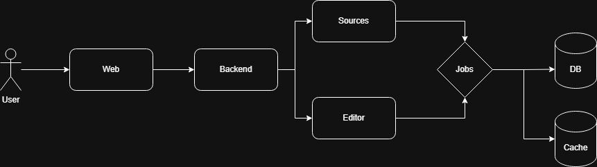

# uplive

Run from the repository root unless a section says otherwise.

## Makefile

```bash
make help
make create
make up-infra
make migrate
make run-api
make run-worker
make migration MSG=describe_change
make test
make lint
```

## Docker

```bash
docker compose -f deployments/docker/docker-compose.yml up --build
docker compose -f deployments/docker/docker-compose.yml down -v
```

Backend only (redis, postgres, api, worker):

```bash
docker compose -f backend/deployments/docker/docker-compose.yml up --build
docker compose -f backend/deployments/docker/docker-compose.yml down -v
```

Redis and Postgres only:

```bash
docker compose -f backend/deployments/docker/docker-compose.infra.yml up -d
docker compose -f backend/deployments/docker/docker-compose.infra.yml down -v
```

Frontend only (requires backend network; use `full` profile):

```bash
docker compose -f frontend/deployments/docker/docker-compose.yml --profile full up --build
docker compose -f frontend/deployments/docker/docker-compose.yml down -v
```

Validate compose:

```bash
docker compose -f deployments/docker/docker-compose.yml config
```

## Local (without Docker)

### Backend

From `./backend`:

```bash
conda env create -f environment.yml
conda activate uplive
uv sync
```

Start infra (`make up-infra` from repo root), apply migrations (`make migrate`), then:

```bash
uvicorn app.main:app --reload --port 8000
```

Worker (separate terminal):

```bash
arq app.worker.WorkerSettings
```

Tests and lint:

```bash
pytest
ruff check . && ruff format .
```

### Frontend

From `./frontend`:

```bash
npm install
npm run dev
npm run build
npm run lint
npm test
```

Vite dev server proxies `/api` to `http://127.0.0.1:8000`.

## Design

### Architecture



The diagram shows the request path from the web client through the API into feature modules for sources and editing, with background work handed off to a job queue. Postgres holds durable source and job records; Redis holds the arq queue and live progress keys. The worker process is not drawn separately, but it runs on the same shared media volume as the API and executes yt-dlp downloads and ffmpeg renders there.

### System design

Uplive is a modular monolith: one Python codebase with clear module boundaries (`sources`, `jobs`, `editor`, `storage`) rather than separate deployable services. The API stays thin (validate, persist, enqueue) while `JobPipeline` owns the multi-step render flow and the worker owns all heavy I/O.

The product flow is deliberately two-phase. First, `POST /api/sources` stores a URL and enqueues `download_source`; the client polls until status is `ready` and uses the preview endpoint for playback. Second, `POST /api/jobs` validates clip ranges against the stored duration, persists the job, and enqueues `render_job`. That split lets the editor work against a stable local file instead of re-fetching YouTube on every export attempt.

The main tradeoff is simplicity over horizontal scale. A single arq worker with `max_jobs = 1` serializes CPU-bound ffmpeg work so one render cannot starve another on a small host. Postgres is the source of truth for status and metadata; Redis is for queue depth and fast progress reads during polling. I cap inputs early (720p download format, 720p export height, max source duration, max clip count) so bad jobs fail at the API instead of halfway through a render.

Long work is always asynchronous. Creating a source or job returns immediately; the React client polls `GET /api/sources/{id}` and `GET /api/jobs/{id}` every 1.5 seconds until ready, done, or error. Progress during renders is written to Redis for low-latency reads and mirrored into Postgres for durability. No WebSockets, no server-sent events.

### Resource management

The API process is lightweight: async FastAPI handlers, short DB queries, and enqueue calls. It should stay responsive even while the worker is busy because ffmpeg and yt-dlp run in the worker via `asyncio.to_thread`, not inside request handlers.

The worker is the resource hog. Each render walks through extract (per clip), merge (with optional fade or slide), and export stages, updating progress at each milestone. Intermediate clip and merged files are written under `WORK_DIR` and deleted after a successful export; failed jobs trigger directory cleanup. Source downloads use the same tree, one folder per source id.

`StorageService` keeps all path logic in one place so a future object-store backend can swap in without touching the pipeline. Today both API and worker read and write the same directories on the shared volume.

Docker gives the API a small memory and CPU budget and the worker a larger one, reflecting that split. Both containers mount the same volume at `/media` so downloaded sources and rendered outputs are visible to preview and download endpoints without copying bytes through the API.

### What breaks first

Under stress, the render admission gate fails first. Before a job is created, the API counts pending arq tasks in Redis and returns `503 queue full` when depth reaches the configured queue limit. That is an intentional, user-visible backpressure signal instead of accepting work the worker cannot finish.

If downloads pile up, they are not gated the same way. Source creates always enqueue `download_source`, so a burst of URLs can fill the arq queue and delay renders even before the 503 path triggers. Inside a running render, ffmpeg is the next bottleneck: one job at a time means queue latency grows linearly with demand.

Disk on the shared volume is the silent limit. Large sources plus temporary clip files for multiple concurrent downloads can exhaust space before CPU does. Cleanup on success and failure helps, but there is no global disk quota yet.

I designed around these limits by keeping the worker serial, surfacing queue fullness as 503, storing progress in Redis with a TTL so stale keys expire, and bounding clip count and source length in request validation.

### Engineering judgment

I did not build separate download and render workers, multi-tenant auth, a distributed object store, or real-time push updates. One worker type and one queue kept local development and Docker Compose wiring straightforward; polling is good enough for a demo-scale editor.

I did not build a full timeline editor, user accounts, or a distributed object store. Clip editing uses numeric in/out fields and native video preview, which covers the demo without canvas-level UI investment. `StorageService` is the seam where S3-style storage would plug in later.

I did not add a download queue cap or priority lanes. Sources and renders share the same arq pool, which is simpler but means a download spike can push out renders until the queue drains.

I did not implement adaptive quality, GPU encoding, or resume-from-checkpoint renders. Every job re-runs extract, merge, and export from scratch. That trades faster iteration on correctness for wasted CPU on retries.

I did not build admin dashboards, metrics export, or automated retention sweeps beyond per-job cleanup. Operational visibility is logs plus DB/Redis inspection.

### 1,000 users at once

At that scale, the first break is the single worker combined with the fixed render queue. Eleven users trying to export at the same time hit `503 queue full`; everyone else waits behind one ffmpeg pipeline, so p95 render time becomes "position in queue times average render duration."

A thousand users submitting YouTube URLs at once would also flood the shared arq queue with downloads, because only renders are capacity-checked today. Redis and Postgres would likely survive the metadata load; the worker and disk would not keep up.

How to fix it, in order:

- Add the same admission control to source creation, or split download and render into separate queues with dedicated worker pools.
- Scale workers horizontally with `max_jobs = 1` per process and shared storage (NFS or object storage with signed URLs) so ffmpeg stays parallel without fighting for CPU on one box.
- Move media off the local volume to S3-compatible storage; serve preview and download via presigned URLs instead of `FileResponse` from disk.
- Put an edge rate limiter in front of `POST /api/sources` and `POST /api/jobs` per IP or account.
- Replace polling with SSE or WebSockets only if product needs sub-second progress; polling is fine at low concurrency but adds needless API traffic at 1,000 clients.

The modular monolith can stay. The boundary that would change first is storage and queue topology, not the Python module layout.
